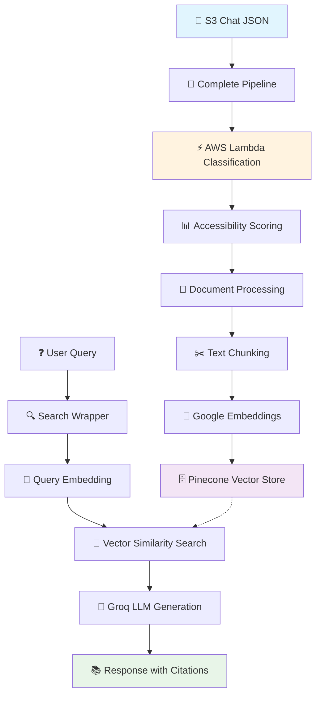

# 🤖 ChatRAG - Intelligent Chat History RAG System

[](https://python.org)
[](https://langchain.com)
[](https://pinecone.io)
[](https://aws.amazon.com)

> **A sophisticated Retrieval-Augmented Generation (RAG) system that processes chat conversations, classifies them using AWS Lambda, and enables intelligent search with citation support.**

## 👨‍💻 Author
**Sahil Ranmbail** - *AI Engineer*

---

## 📋 Table of Contents
- [🎯 Overview](#-overview)
- [🏗️ Architecture](#️-architecture)
- [✨ Features](#-features)
- [🔧 Installation](#-installation)
- [⚙️ Configuration](#️-configuration)
- [🚀 Usage](#-usage)
- [📊 Pipeline Workflow](#-pipeline-workflow)
- [🔍 Search & Query](#-search--query)
- [📁 Project Structure](#-project-structure)
- [🤝 Contributing](#-contributing)

---

## 🎯 Overview

ChatRAG is an end-to-end RAG system designed to:
- 📥 **Ingest** chat conversations from S3 storage
- 🧠 **Classify** conversations using AWS Lambda (work/personal)
- ⚡ **Process** and chunk text for optimal retrieval
- 🔍 **Store** embeddings in Pinecone vector database
- 💬 **Enable** intelligent search with proper citations

---

## 🏗️ Architecture



---

## ✨ Features

### 🔄 **Data Pipeline**
- **S3 Integration**: Direct processing from S3 URIs
- **Lambda Classification**: Automatic work/personal categorization
- **Smart Chunking**: Optimized text splitting for better retrieval
- **Metadata Preservation**: Complete conversation context retention

### 🔍 **Search & Retrieval**
- **Vector Similarity**: Semantic search using Google embeddings
- **User Filtering**: Search within specific user's conversations
- **Citation Support**: Automatic source referencing
- **Confidence Scoring**: Accessibility classification confidence

### 🤖 **AI Integration**
- **Google Embeddings**: `text-embedding-004` model
- **Groq LLM**: High-performance language model
- **Pinecone**: Serverless vector database
- **LangChain**: Orchestration framework

---

## 🔧 Installation

### Prerequisites
- 🐍 Python 3.8+
- 🔑 AWS Account with S3 access
- 🌲 Pinecone account
- 🔐 Google AI API key
- ⚡ Groq API key

### Setup Steps

1. **Clone the repository**
```bash
git clone https://github.com/SahiL911999/ChatRAG---Intelligent-Chat-History-RAG-System.git
cd ChatRAG---Intelligent-Chat-History-RAG-System
```

2. **Create virtual environment**
```bash
python -m venv virenv
# Windows
virenv\Scripts\activate
# Linux/Mac
source virenv/bin/activate
```

3. **Install dependencies**
```bash
pip install -r requirements.txt
```

4. **Configure environment variables**
```bash
cp .env.example .env
# Edit .env with your API keys
```

---

## ⚙️ Configuration

Create a `.env` file with the following variables:

```env
# 🔐 API Keys
GOOGLE_API_KEY=your_google_api_key
PINECONE_API_KEY=your_pinecone_api_key
GROQ_API_KEY=your_groq_api_key

# 👤 User Configuration
CHAT_USER=Your Name
CHAT_ENGINE=ChatGPT

# ☁️ AWS Configuration
bucket_name=your-s3-bucket
folder_name=your-folder-name
region=us-east-1

# 🗄️ Pinecone Configuration
PINECONE_INDEX=your-index-name
Dimension=768
```

---

## 🚀 Usage

### 📥 **Data Ingestion**

```python
from complete_pipeline import s3_json_load_ingest

# Define Lambda event for classification
test_event = {
    "category_one": "personal",
    "category_two": "work", 
    "file_path": "s3://your-bucket/path/to/chat.json"
}

# Process and ingest data
s3_json_load_ingest(
    s3_uri=test_event["file_path"], 
    lambda_event=test_event
)
```

### 🔍 **Search & Query**

```python
from search_wrapper import RAGCitationEngine

# Initialize the search engine
rag_engine = RAGCitationEngine()

# Query with citations
result = rag_engine.query(
    query="How to fix Windows settings?",
    chat_user="sahil Ranmbail"  # Optional: filter by user
)

print("Answer:", result["answer"])
print("References:", result["references"])
```

---

## 📊 Pipeline Workflow

### 🔄 **Complete Pipeline Process**

```
📁 S3 JSON File
    ↓
⚡ AWS Lambda Classification
    ↓ (Confidence Scoring)
📊 Accessibility Determination
    ↓
📝 Document Creation
    ↓
✂️ Text Chunking (150 chars, 30 overlap)
    ↓
🧮 Google Embeddings Generation
    ↓
🗄️ Pinecone Vector Storage
```

### 🎯 **Classification Logic**
- **Work**: `category_two.probability >= 0.9`
- **Personal**: `category_two.probability < 0.9`
- **Confidence Score**: Stored with each document

### 📝 **Document Structure**
```json
{
  "page_content": "Chat message content",
  "metadata": {
    "chat_engine": "ChatGPT",
    "chat_account": "User Name",
    "chat_id": "unique-chat-id",
    "title": "Conversation Title",
    "accessibility": "work|personal",
    "accessibility_confidence_score": 0.95,
    "chunk_id": "chat_id::turn_id::chunk_index"
  }
}
```

---

## 🔍 Search & Query

### 🎯 **Search Features**
- **Semantic Search**: Vector similarity matching
- **User Filtering**: Search specific user's chats
- **Citation Tracking**: Automatic source referencing
- **Metadata Rich**: Full conversation context

### 📚 **Citation Format**
```python
{
  "answer": "Windows settings can be reset through... [1]",
  "references": [
    {
      "source_id": "[1]",
      "title": "Windows Settings Fix",
      "chat_id": "abc-123",
      "turn_id": "def-456", 
      "timestamp": "2025-01-15 10:30:00"
    }
  ]
}
```

---

## 📁 Project Structure

```
chatrag/
├── 📄 complete_pipeline.py    # Main ingestion pipeline
├── 🔍 search_wrapper.py       # Search & query engine
├── 📋 requirements.txt        # Dependencies
├── ⚙️ .env                   # Environment variables
├── 📚 README.md              # This file
├── 🚫 .gitignore             # Git ignore rules
└── 📁 virenv/                # Virtual environment
```

### 🗂️ **Core Files**

| File | Purpose | Key Features |
|------|---------|--------------|
| `complete_pipeline.py` | 📥 Data ingestion | S3 → Lambda → Pinecone |
| `search_wrapper.py` | 🔍 Search engine | RAG + Citations |
| `requirements.txt` | 📦 Dependencies | All required packages |
| `.env` | ⚙️ Configuration | API keys & settings |

---

## 🔧 Advanced Configuration

### 🎛️ **Chunking Parameters**
```python
# Adjust in complete_pipeline.py
splitter = RecursiveCharacterTextSplitter(
    chunk_size=150,      # Optimal for chat messages
    chunk_overlap=30,    # Context preservation
    separators=["\n\n", "\n", " ", ""]
)
```

### 🎯 **Search Parameters**
```python
# Adjust in search_wrapper.py
def query(self, query: str, chat_user: str = "", k: int = 10):
    # k = number of similar documents to retrieve
```

---

## 🚨 Troubleshooting

### Common Issues

**🔑 Authentication Errors**
- Verify all API keys in `.env`
- Check AWS credentials configuration

**📊 Empty Results**
- Ensure Pinecone index exists
- Verify data ingestion completed successfully

**🔍 Search Issues**
- Check user filter spelling
- Verify embeddings model consistency

---

## 🤝 Contributing

1. Fork the repository
2. Create a feature branch (`git checkout -b feature/amazing-feature`)
3. Commit changes (`git commit -m 'Add amazing feature'`)
4. Push to branch (`git push origin feature/amazing-feature`)
5. Open a Pull Request

---

## 📄 License

This project is licensed under the MIT License - see the [LICENSE](LICENSE) file for details.

---

## 🙏 Acknowledgments

- **LangChain** for the RAG framework
- **Pinecone** for vector database services
- **Google AI** for embedding models
- **Groq** for high-performance LLM inference
- **AWS** for cloud infrastructure

---

<div align="center">

**Built with ❤️ by Sahil Ranmbail**

[](https://github.com/sahilranmbail)
[](https://linkedin.com/in/sahilranmbail)

</div>